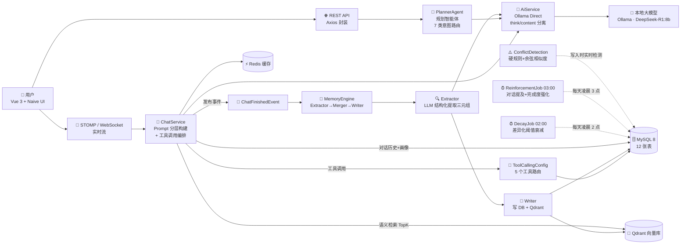

# Personal AI OS · 个人 AI 操作系统

> 一个会**记住你**、并基于长期记忆帮你做**目标管理 + 任务规划 + 主动提醒**的本地 AI 助手。
>
> Spring Boot 3 + Spring AI + Ollama（DeepSeek-R1 推理模型）+ Qdrant 向量库 + Vue 3 · WebSocket 流式渲染 · 仿人类记忆生命周期机制

---

## ✨ 功能特性

| 模块 | 能力 | 对应代码 |
| --- | --- | --- |
| 🔐 **账号体系** | 注册 / 登录 / JWT 鉴权 / Pinia 会话持久化 | `AuthController` · `JwtInterceptor` · `Login.vue` |
| 💬 **流式聊天** | STOMP/WebSocket 实时推流 · DeepSeek-R1 `<think>` 推理过程与正式回答双通道分离渲染 · 历史会话管理 | `WebSocketChatController` · `AiService.streamOllamaDirectly` · `Chat.vue` |
| 🛠️ **工具调用** | 5 个自定义工具（记忆/目标/待办/时间线/提醒），`<tool>` 标签正则解析 + 关键词兜底路由 + 工具结果二次 LLM 编排 | `ToolCallingConfig` · `TodoTool`/`GoalTool`/`MemoryTool`/`TimelineTool`/`ReminderTool` |
| 📝 **长期记忆** | 从对话里自动提取「个人信息 / 偏好 / 技能 / 目标 / 待办 / 时间线」知识图谱三元组，写入关系库 + 向量库，强制 sourceQuote 来源校验 | `memory/Extractor` · `memory/Writer` · `MemoryAttribute` 表 |
| 🧠 **记忆生命周期** | 凌晨2点 **DecayJob** 差异化阈值衰减（姓名/生日永不衰减、待办 7 天休眠/30 天归档、专业信息 180 天归档 + 四级状态机 ACTIVE→DORMANT→ARCHIVED→DELETED）；凌晨3点 **ReinforcementJob** 按「对话提及 / 目标完成 / 待办完成 / 时间线引用」四类反向强化重要性 | `memory/DecayJob` · `memory/ReinforcementJob` |
| ⚠️ **记忆冲突检测** | 「喜欢↔讨厌 / 擅长↔不擅长」等矛盾词对硬规则 + Embedding 余弦相似度双路检测，冲突入库走人工 Review 面板；每条变更自动写入 history 版本快照 | `ConflictDetectionService` · `MemoryReviewController` · `Review.vue` |
| 📌 **向量语义检索** | Qdrant + nomic-embed-text 做 TopK 相似召回，按 `userId` 元数据过滤保证多用户隔离 | `VectorStoreService` · `QdrantConfig` |
| 🎯 **PlannerAgent 规划智能体** | 7 类意图关键词路由（目标分解 / 任务调度优先级 / 进度更新 / 计划调整 / 每日总结 / 明日计划 / 任务推荐），结构化 JSON 强约束解析后写库 | `agent/PlannerAgent` · `PlannerService` · `Planner.vue` |
| 📤 **每日总结调度** | 定时生成每日总结与明日计划，主动推送（事件驱动 + Redis 缓存） | `scheduler/DailySummaryScheduler` · `NotificationController` |
| 🚦 **工程基建** | Redis 对话缓存 + LinkedHashMap 退化兜底、ChatFinishedEvent 事件驱动异步记忆提取、GlobalExceptionHandler 全局异常、MySQL healthcheck、双 profile 开发/生产环境分离 | `config/*` · `ChatService` · `GlobalExceptionHandler` · `docker-compose.yml` |

---

## 🏗️ 系统架构



**一次对话的完整数据流：**
1. 前端发送消息 → WebSocket 落库 + 更新 Redis 缓存；
2. `buildPrompt` 按「系统时间 → 工具约束 → 用户画像 → 最近 10 条对话 → Qdrant Top5 语义记忆 → 分类结构化记忆 → 当前问题」10 层优先级注入上下文；
3. 绕过 Spring AI 直接调 Ollama 流式 API，逐行解析 JSON，独立推送 think / content 两个通道；
4. 流结束后检测 `<tool>` 标签，命中则执行对应工具，用工具返回结果构造第二次 prompt 再生成一次回复；
5. 保存 AI 回复 → 发 `ChatFinishedEvent` 给 `MemoryListener` → `MemoryEngine` 异步提取新记忆；
6. 夜间定时：2 点衰减过时记忆、3 点强化高频记忆，保证记忆库"越用越像你"。

---

## 🧠 核心机制亮点

### 1. 仿人类记忆的生命周期

不是所有信息都同等重要。我们用**双定时任务 + 差异化阈值**模拟人脑遗忘 + 巩固：

| 记忆类型 | 休眠 Dormant | 归档 Archived | 删除 Deleted | 备注 |
| :-- | :-- | :-- | :-- | :-- |
| 姓名 / 生日 | ∞ | ∞ | ∞ | `skipDecay` 永不衰减 |
| 待办 Todo | 7 天 | 30 天 | 180 天 | 完成的 Todo 额外走 completed 分支 |
| 目标 Goal | 15 天 | 45 天 | 365 天 | |
| 时间线 Timeline | 14 天 | 60 天 | 365 天 | |
| 偏好 Preference | 30 天 | 90 天 | 365 天 | |
| 专业 / 学校 | 60 天 | 180 天 | 730 天 | 身份类长周期 |

**强化规则（凌晨 3 点 ReinforcementJob）：**
- 最近 7 天对话中提及过 → `importance +3 / confidence +1`，并刷 `lastAccessTime` 重置衰减计时；
- 目标完成 `progress ≥ 100` → Goal 自身 `+5`、关联 Fact `+5`；
- Todo 标记已完成 → Todo 自身 `+5`、关联 Fact `+5`；
- 时间线标题/描述中包含 Fact → Fact `+3`。

### 2. 工具调用：`<tool>` 自定义标签 + 多链路容错

本地 8B 推理模型指令遵循较弱，Spring AI function calling 易失效，工程上做了三层兜底：
1. **Prompt 强约束**：分「必须调用场景 / 绝对禁止场景 / 直接回答场景」三种规则，给完整正例；
2. **正则解析**：同时兼容 `<tool>...</tool>` 和 `(tool ...)` 两种写法；
3. **Unknown Tool 自动清理**：模型乱输出工具名时，自动剥掉工具标签给用户纯自然语言回复。

### 3. 冲突检测：硬规则 + Embedding 双路判定

当用户更新记忆时（例如之前说"喜欢哈利波特"现在说"讨厌哈利波特"）：
1. 先走矛盾词对（喜欢↔讨厌 / 爱↔恨 / 擅长↔不擅长 等 14 组）做**硬规则匹配**；
2. 非矛盾类变更走 **nomic-embed-text Embedding + 余弦相似度**：
   - 相似度 `< 0.3` → 认定语义冲突，入库 PENDING 等用户 Review；
   - 相似度 `≥ 0.8` → 认定同义重述，直接更新；
   - 中间区间 → 视为值有变化，正常更新；
3. 每次变更前自动在 `memory_fact_history` 写入旧值版本快照，可回溯。

### 4. PlannerAgent：7 类意图路由 + 结构化输出解析

PlannerAgent 针对「目标规划管理」这一垂直场景做了**确定性路由 + LLM 子任务执行**的混合架构：

```
用户请求
   ├─ goal / plan / learn / study     → decomposeGoal  大目标拆分子任务+子待办
   ├─ schedule / priorit / arrange    → scheduleTasks  重排优先级并批量更新
   ├─ complete / progress / update    → updateProgress 更新目标进度+勾选待办
   ├─ adjust / modify / change        → adjustPlan     调计划+生成新目标/新待办
   ├─ summary / review / today        → dailySummary   每日总结+完成率+建议
   ├─ tomorrow                        → tomorrowPlan   明日聚焦领域+任务时段安排
   ├─ recommend / suggest             → recommendations AI 推荐做什么
   └─ 其他                             → decomposeGoal  兜底走目标分解
```

每个子方法都会**把用户画像、现有目标、未完成待办**注入 prompt，再用严格的 JSON 模板要求 LLM 返回结构化结果，解析后直接写库。

---

## 🛠️ 技术栈

### 后端（Java 17 · Spring Boot 3.2.10）
| 类别 | 选型 | 版本 |
| :-- | :-- | :-- |
| 基础框架 | Spring Boot | 3.2.10 |
| AI SDK | Spring AI（Core + Ollama Starter + Qdrant Store） | 1.0.0-M3 |
| 本地大模型 | Ollama · DeepSeek-R1:8b | 推理模型，本地部署 |
| Embedding | nomic-embed-text | 语义向量化 |
| ORM | MyBatis-Plus | 3.5.6 |
| 数据库 | MySQL | 8.0 |
| 缓存 | Redis | 7.2-alpine |
| 向量库 | Qdrant | v1.18.1 |
| 鉴权 | JJWT | 0.12.5 |
| 实时通信 | WebSocket（STOMP + SockJS） | Spring 自带 |
| 异步 & 定时 | `@EnableAsync` 线程池（core=5/max=10/queue=25） + `@Scheduled` cron | |
| 打包 | Maven + 多阶段 Dockerfile（Eclipse Temurin 17 → JRE Alpine） | |

### 前端（Vue 3 + TypeScript + Vite 5）
| 类别 | 选型 | 版本 |
| :-- | :-- | :-- |
| 框架 | Vue | 3.4.21 |
| 构建工具 | Vite | 5.0.12 |
| 类型系统 | TypeScript | 5.3.3 |
| UI 库 | Naive UI | 2.38.1 |
| 状态管理 | Pinia | 2.1.7 |
| 路由 | Vue Router | 4.2.5 |
| HTTP | Axios | 1.6.5 |
| WebSocket | @stomp/stompjs + sockjs-client | 7.3.0 + 1.6.1 |
| 打包 | nginx:alpine + 多阶段 Dockerfile | |

### 基础设施
- Docker Compose 双 profile：默认「本地 IDE 开发」，`--profile full` 一键全容器化上线；
- 容器 healthcheck：MySQL ping、Redis 带密码 ping、Qdrant collections 接口、后端 `/api/auth/me`；
- Windows 本地一键启动：`start.ps1` 按顺序兜底检查 MySQL80 / Docker Desktop / Redis+Qdrant 容器 / Ollama。

---

## 📁 项目结构

```
Personal-AI-OS/
├── backend/                         # Spring Boot 后端
│   ├── Dockerfile                   # 多阶段 maven → jre-alpine
│   ├── pom.xml                      # 依赖与版本管理
│   └── src/main/
│       ├── java/com/personalai/os/
│       │   ├── agent/               # PlannerAgent 规划智能体 + 配置
│       │   ├── config/              # 异步/CORS/JWT拦截/Redis/Qdrant/WebSocket/工具调用
│       │   ├── controller/          # 15 个 REST + WebSocket 控制器
│       │   ├── dto/                 # request/response 对象
│       │   ├── entity/              # 13 个数据库实体（User + 9类记忆 + 会话 + 冲突+历史+引用）
│       │   ├── event/               # ChatFinishedEvent + MemoryListener 异步记忆提取
│       │   ├── exception/           # 全局异常处理器
│       │   ├── interceptor/         # JWT 拦截器
│       │   ├── mapper/              # 14 个 MyBatis-Plus Mapper
│       │   ├── memory/              # 记忆引擎核心
│       │   │   ├── Extractor.java   #   LLM 三元组提取
│       │   │   ├── Merger.java      #   提取结果合并
│       │   │   ├── Writer.java      #   写关系库+向量库
│       │   │   ├── MemoryEngine.java#  总调度 E→M→W
│       │   │   ├── DecayJob.java    #   2:00 衰减定时任务
│       │   │   ├── ReinforcementJob.java # 3:00 强化定时任务
│       │   │   ├── Scorer/Classifier/Reader/Reminder 等
│       │   │   └── dto/             #   提取结果 DTO
│       │   ├── scheduler/           # DailySummaryScheduler 每日总结调度
│       │   ├── service/             # 17 个 Service 层
│       │   │   ├── AiService.java   #   大模型交互核心（流式/think分离/工具解析）
│       │   │   ├── ChatService.java #   Prompt分层+工具调用循环+事件发布
│       │   │   ├── VectorStoreService.java # Qdrant 读写+检索
│       │   │   └── ConflictDetectionService.java # 冲突检测+版本快照
│       │   ├── tool/                # 5 个 AI 可调用工具（Todo/Goal/Memory/Timeline/Reminder）
│       │   └── util/                # JwtUtil / PasswordEncoderUtil
│       └── resources/
│           ├── application.yml      # 后端配置（Ollama模型/Redis/Qdrant/JWT/MySQL等）
│           ├── schema.sql           # 12 张核心表 DDL
│           └── mapper/*.xml         # 复杂 SQL（MyBatis XML 映射）
│
├── frontend/                        # Vue 3 前端
│   ├── Dockerfile                   # 多阶段 node:20 build → nginx:alpine
│   ├── nginx.conf                   # 前端路由 history 模式兜底（COPY 进镜像）
│   ├── package.json                 # 依赖与脚本
│   └── src/
│       ├── api/index.ts             # Axios 统一封装
│       ├── components/              # 全局组件（通知监听等）
│       ├── composables/             # useWebSocketChat / useNotification
│       ├── stores/                  # auth / session（Pinia）
│       ├── router/index.ts          # 登录 + 4 个子页面路由守卫
│       └── views/
│           ├── Login.vue            # 登录/注册页
│           ├── MainLayout.vue       # 主框架
│           ├── Chat.vue             # 流式聊天 + 会话列表（含折叠推理过程）
│           ├── Memory.vue           # 记忆查看/编辑/筛选
│           ├── Planner.vue          # PlannerAgent 规划页
│           └── Review.vue           # 记忆冲突人工审核页
│
├── docker-compose.yml               # 双 profile 编排（dev 默认轻量，full 全容器）
├── start.ps1                        # Windows 一键基础设施检查与启动（MySQL+Docker+Redis+Qdrant+Ollama）
├── add_comments.py                  # 批量给 Java 文件补 Javadoc（开发辅助脚本）
└── .gitignore                       # 产物/依赖/环境变量忽略清单
```

---

## 🚀 快速开始

### 前置要求

| 依赖 | 最低版本 | 说明 |
| :-- | :-- | :-- |
| JDK | 17 | 后端运行与编译 |
| Maven | 3.9+ | 后端构建 |
| Node.js | 20+ | 前端构建（对应 Dockerfile 基础镜像） |
| MySQL | 8.0 | 关系数据 |
| Docker Desktop | 最新版 | 跑 Redis + Qdrant 容器 |
| Ollama | 最新版 | 本地大模型，需要先 `ollama pull deepseek-r1:8b` + `ollama pull nomic-embed-text` |

### 方式一：Windows 本地开发（推荐，秒级重启 + 可打断点）

**第 1 步：启动基础设施**

在项目根目录打开 PowerShell，执行：
```powershell
.\start.ps1
```
脚本会自动检查并启动：MySQL80 服务 → Docker Desktop → Redis 容器 → Qdrant 容器 → Ollama 端口监听。

> MySQL 启动需要管理员权限，脚本会自动弹 UAC，请点「是」。

**第 2 步：初始化数据库**

手动用 Navicat / MySQL CLI 执行 `backend/src/main/resources/schema.sql` 创建 12 张表（默认库名 `personal_ai_os`，账号 root/123456，如不同修改 `application.yml`）。

**第 3 步：拉取本地大模型（首次必做）**
```powershell
ollama pull deepseek-r1:8b
ollama pull nomic-embed-text
```

**第 4 步：启动后端**
- 用 IntelliJ IDEA 打开 `backend/pom.xml`，直接运行 `PersonalAiOsApplication.main()`；
- 或命令行：
  ```powershell
  cd backend
  mvn spring-boot:run
  ```
后端监听 `http://localhost:8080`。

**第 5 步：启动前端**
```powershell
cd frontend
npm install
npm run dev
```
Vite 启动后访问 `http://localhost:5173`，注册账号 → 登录 → 开始使用。

### 方式二：Docker Compose 全容器化（生产 / 演示用）

MySQL、后端、前端也可以直接进容器：
```powershell
docker compose --profile full up -d --build
```
服务启动后访问：
- 前端：`http://localhost:80`（Nginx 托管）
- 后端：`http://localhost:8080/api/...`
- Qdrant UI：`http://localhost:6333/dashboard`

---

## 🔧 关键配置（application.yml / docker-compose.yml）

| 配置项 | 默认值 | 说明 |
| :-- | :-- | :-- |
| `server.port` | 8080 | 后端端口 |
| `spring.datasource.url/username/password` | localhost:3306 / root / 123456 | MySQL 连接 |
| `spring.data.redis.host/port/password` | localhost:6379 / 123456 | Redis |
| `spring.ai.ollama.base-url` | `http://localhost:11434` | Ollama 服务地址 |
| `spring.ai.ollama.chat.options.model` | `deepseek-r1:8b` | 聊天模型 |
| `spring.ai.ollama.embedding.options.model` | `nomic-embed-text` | Embedding 模型 |
| `spring.ai.vectorstore.qdrant.host/port/collection-name` | localhost / 6334 / memory | 向量库参数 |
| `jwt.secret / jwt.expiration` | — | JWT 签名密钥 + 过期毫秒数（默认 24h） |
| `logging.level.com.personalai.os.*` | DEBUG | 业务日志级别 |

docker-compose 中 `backend` 服务通过 `SPRING_AI_OLLAMA_BASE_URL=http://host.docker.internal:11434` 访问宿主机 Ollama，保证容器内外共用同一个本地模型。

---

## 🧭 路线图 & 可扩展方向

以下为当前仓库**尚未实现、但可作为后续迭代**的内容（区分于已实现事实）：

- [ ] 多步 ReAct Agent：放开 `MAX_TOOL_CALLS = 1` 限制，做完整的思考-行动循环 + 最大步数熔断；
- [ ] PlannerAgent 接入原生 Spring AI Function Calling，替换当前关键词路由；
- [ ] 多用户权限：当前按 userId 做数据隔离，但未做 RBAC 角色体系；
- [ ] 记忆导出为 md / JSON，便于备份和迁移；
- [ ] Mobile 响应式 + PWA 离线缓存；
- [ ] 语音输入 / 语音朗读（接入 Whisper + TTS）；
- [ ] 插件市场式工具注册发现中心。

---

## 📝 License

本项目在满足以下条件时欢迎使用/二次开发：**保留作者版权声明 + 相同方式共享**。

MIT License · Copyright © 2026 唐琦（Tang Qi）
